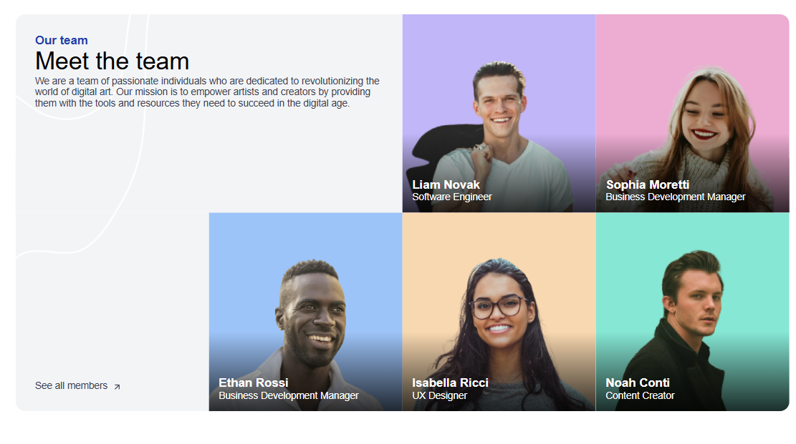

# Meet the Team Section | devChallenges

Solution for a challenge [Meet the Team Section](https://devchallenges.io/challenge/meet-the-team-section-challenge) from [devChallenges.io](http://devchallenges.io).

## [Demo](https://our-team-layout-nickescolr.netlify.app/) | [Challenge](https://devchallenges.io/challenge/meet-the-team-section-challenge)

## Table of Contents

- [Overview](#overview)
  - [What I learned](#what-i-learned)
- [Built with](#built-with)
- [Features](#features)
- [Author](#author)

## Overview



This project is a responsive team section layout that showcases team members with a clean, modern design. The layout adapts beautifully to different screen sizes, providing an optimal viewing experience on desktop, tablet, and mobile devices.

### What I learned

- Advanced CSS Grid layout techniques for responsive designs
- Creating smooth image hover effects with scale transformations
- Implementing accessible focus states for interactive elements
- Working with CSS gradients for elegant text overlays
- Using CSS animations for interactive elements

Here's a snippet of the CSS Grid implementation I'm proud of:

```css
.team {
  margin: 4rem auto;
  max-width: calc(100dvw - calc(40px * 2));
  border-radius: 16px;
  overflow: hidden;
  display: grid;
  grid-template-columns: repeat(auto-fit, minmax(280px, 1fr));
  grid-auto-rows: minmax(280px, 1fr);
}

@media screen and (min-width: 1025px) {
  .team-header {
    grid-column: span 2;
  }

  .team-footer {
    grid-column: 1;
    grid-row: 2;
  }
}
```

## Built with

- Semantic HTML5 markup
- CSS custom properties
- Flexbox
- CSS Grid
- CSS Animations
- Mobile-first workflow

## Features

This application showcases a responsive team section with:

- Hover effects on team member cards
- Responsive layout that adapts to desktop, tablet, and mobile views
- Accessible keyboard navigation support
- Gradient overlays for text readability
- Interactive elements with smooth transitions

This project was created as a submission to a [DevChallenges](https://devchallenges.io/challenges-dashboard) challenge.

## Author

- GitHub [@NickEsColR](https://github.com/NickEsColR)
